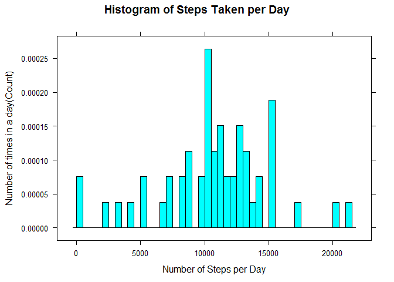
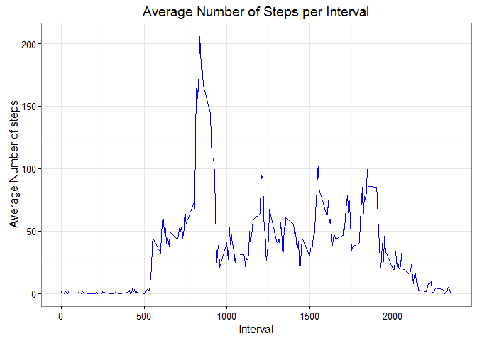
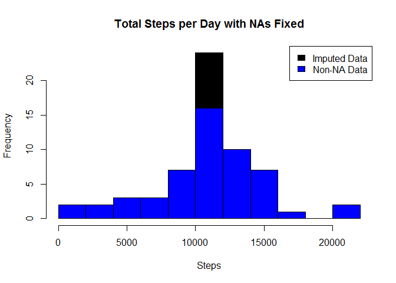
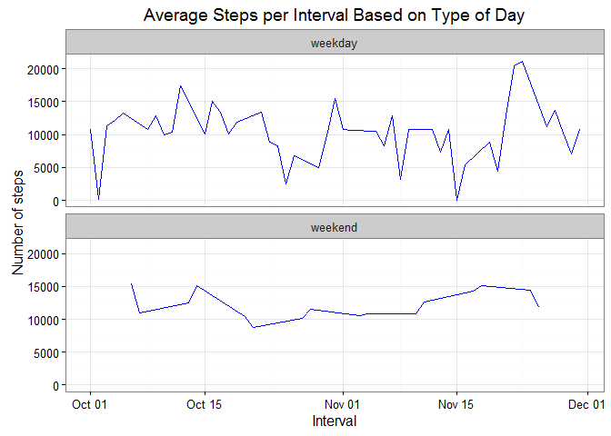

Reproducible Research: Project 1
================================

### 1 Load and process the dataset

``` r
library("ggplot2", lib.loc="~/R/win-library/3.3")
library("plyr", lib.loc="~/R/win-library/3.3")
library("lattice", lib.loc="C:/Program Files/R/R-3.3.2/library")
 
rdata <- read.csv('activity.csv', header = TRUE, sep = ",")
 
rdata$date <- as.Date(rdata$date, format = "%Y-%m-%d")
rdata$interval <- as.factor(rdata$interval)
```

### 2 Create a Histogram of the total number of steps taken each day

``` r
# aggregate steps per day ---------------
steps_per_day <- aggregate(steps ~ date, rdata, sum)
colnames(steps_per_day) <- c("date","steps")
 
histogram(date~steps ,steps_per_day, breaks=53,
          type="density",
          xlab="Number of Steps per Day",
          ylab="Number of times in a day(Count)",
          main="Histogram of Steps Taken per Day")
```



### 3 What are mean and median of the total number of steps taken each day?

``` r
SPD_mean   <- mean(steps_per_day$steps, na.rm=TRUE)
SPD_median <- median(steps_per_day$steps, na.rm=TRUE)
```

The average number of steps taken each day was 10766 steps. The median number of steps taken each day was 10765 steps.

### 4 What is the average number of steps taken per interval?

``` r
steps_per_interval <- aggregate(rdata$steps,
                                by = list(interval = rdata$interval),
                                FUN=mean, na.rm=TRUE)
 
#convert integers for plotting
steps_per_interval$interval <-
        as.integer(levels(steps_per_interval$interval)[steps_per_interval$interval])
colnames(steps_per_interval) <- c("interval", "steps")
 
 
## plot the time series of the average number of steps taken
## versus the 5-minute intervals
ggplot(steps_per_interval, aes(x=interval, y=steps)) +  
        geom_line(color="blue") + 
        labs( x="Interval", y="Average Number of steps") + 
        ggtitle("Average Number of Steps per Interval") + theme_bw()
```



### 5 Which interval, on average across all the days in the dataset, contains the maximum number of steps? what is the Max number of steps taken in an interval?

``` r
##Maximum steps by interval
maxSteps <- max(steps_per_interval$steps)
##Which interval contains the maximum average number of steps
maxinterval <- steps_per_interval[steps_per_interval$steps==maxSteps,1]
```

The maximum number of steps during a 5-minute interval was 206 steps. The 835th interval had the maximum number of steps.

### 6 Provide Code to describe and show strategy for inputing missing data.

``` r
# Replace each missing value with the mean value of its 5-minute interval
value_filled <- function(steps, interval) {
        filled <- NA
        if (!is.na(steps))
                filled <- c(steps)
        else
                filled <- (steps_per_interval[steps_per_interval$interval==interval, "steps"])
        return(filled)
}
 
#load missing values
rdata_filled <- rdata
rdata_filled$steps <- mapply(value_filled, rdata_filled$steps, rdata_filled$interval)
```

### 7 Create histogram of total steps per day, categorized by data set to show impact of filling in missing data.

``` r
# aggregate steps per day
steps_per_day_filled <- aggregate(steps ~ date, rdata_filled, sum)
 
hist(steps_per_day_filled$steps, breaks=15,
     xlab="Steps", col="Black",
     main = "Total Steps per Day with NAs Fixed" )
hist(steps_per_day$steps, breaks=15,
     xlab="Steps", col="Blue",
     main = "Total Steps per Day with NAs Fixed", add=T)
legend("topright", c("Imputed Data", "Non-NA Data"), fill=c("black", "blue") )
```



### 8 Are there differences in activity patterns between weekdays and weekends?

``` r
typeofday <- function(date) {
        day <- weekdays(date)
        if (day %in% c("Monday", "Tuesday", "Wednesday", "Thursday", "Friday"))
                return("weekday")
        else if (day %in% c("Saturday", "Sunday"))
                return("weekend")
        else
                stop("invalid date")
}
 
# load up the type of day for each observation
typeofday_filled <- cbind(steps_per_day_filled, c(1:61))
colnames(typeofday_filled) <- c( "date", "steps", "day")
typeofday_filled$day  <- sapply(typeofday_filled$date, FUN=typeofday)
 
ggplot(typeofday_filled, aes(x=date, y=steps)) +
        geom_line(color="blue") +
        facet_wrap(~ day, nrow=2, ncol=1) +
        labs(x="Interval", y="Number of steps") +
        ggtitle("Average Steps per Interval Based on Type of Day" ) + theme_bw()
```


